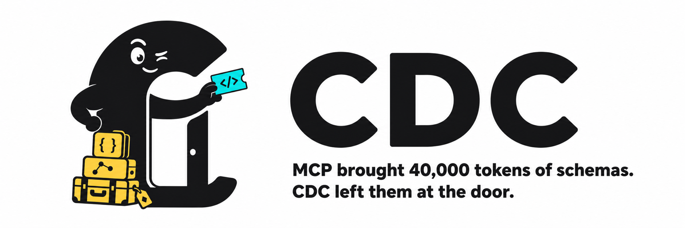

<p align="center">
  
</p>

<p align="center">
  
  
  
  
</p>

<p align="center">
  <strong>Benchmarked on <code>gpt-5.6-sol</code></strong> · Codex CLI · medium reasoning<br>
  <sub>~24% fewer tokens on a 10-MCP suite · up to ~53% on fat CLI surfaces · hybrid keeps small MCPs native</sub>
</p>

---

## What it is

**Code-Call Descriptors.** Turn MCP servers into short Agent Skills so Claude Code and Codex stop paying full tool schemas every turn.

You still get the tools. The model just doesn't have to *swallow the menu* first.

| | MCP connected | CDC skill |
|---|---|---|
| Context tax | every schema, every session | ~few hundred tokens |
| How you call | tool round-trips | short script / bridge |
| Fat surfaces | expensive | **cheap** |
| Tiny surfaces | already fine | hybrid keeps MCP |

Always-on hybrid router: even if you say *"use MCP github"*, it still checks which path is cheaper. First convert prints a one-time cost line; later sessions stay cheaper.

---

## Install

Needs Node 18+ on your PATH.

### Both agents (recommended)

```bash
git clone https://github.com/nassimkhatiba-ai/cdc.git && cd cdc
node bin/cdc.js install-plugin
```

Skills go to `~/.claude/skills` + `~/.codex/skills`.  
Always-on: Claude hooks + `~/.codex/AGENTS.md`.  
Restart Claude Code / Codex after install.

### Claude Code only

```bash
claude plugin marketplace add nassimkhatiba-ai/cdc
claude plugin install cdc@cdc
```

### Codex only

```bash
git clone https://github.com/nassimkhatiba-ai/cdc.git && cd cdc
node bin/cdc.js install-creator --target codex
```

More detail: [INSTALL.md](INSTALL.md).

---

## Use it

Say anything like:

- *Convert my GitHub MCP into a CDC skill*
- *Use the github MCP* (still cost-checks first)
- *Using the github-cdc skill, how many stars does torvalds/linux have?*

First time a fat MCP has no skill yet, the agent should tell you in chat:

> *First time creating CDC costs ~X% more than MCP once, but next times it will be ~Y% cheaper than MCP native with same accuracy.*

Then it converts.

- `preferTransport: cdc` → disable the same-name MCP (don't pay both taxes)
- `preferTransport: mcp` → leave MCP on (small surface already wins)

---

## Before / after

**Before:** connect GitHub MCP → millions of schema tokens in the room → ask for one star count → context is already full of tools you'll never touch.

**After:** install `github-cdc` → ~900 token skill → agent greps `CDC.md`, runs a short script, answers. Schemas stay out of the window.

```
MCP server  --cdc-->  ~/.claude/skills/github-cdc/
                        SKILL.md     tiny preamble
                        CDC.md       one line per tool
                        mcp-call.js  bridge (when needed)
```

---

## Numbers - `gpt-5.6-sol` (fresh rebench)

**Model:** `gpt-5.6-sol` · reasoning `medium` · Codex CLI · 2026-07-12  
**Suite:** 10 real MCPs, 45 score keys, MCP-connected vs text CDC skill

### Suite headline

| | MCP | CDC text |
|---|---:|---:|
| **Accuracy** | **45/45 (100%)** | **39/45 (87%)** |
| **Total tokens** | 155,309 | **118,470** |
| **vs MCP** | - | **-23.7% tokens** |

Where **both** arms scored full marks (7 targets: everything, memory, sqlite, context7, fetch, github, calc):

| | tokens |
|---|---:|
| MCP | 107,078 |
| CDC | **83,160** (**-22.3%**) |

### Best Sol wins (full accuracy both sides)

| target | MCP | CDC | under |
|--------|----:|----:|------:|
| everything | 18,500 | **8,624** | **-53%** |
| calc | 17,410 | **8,230** | **-53%** |
| github | 19,228 | **9,749** | **-49%** |
| fetch | 15,931 | **9,017** | **-43%** |
| memory | 17,609 | **12,805** | **-27%** |

### Small surface (hybrid keeps MCP)

| arm | tokens | task |
|-----|-------:|------|
| MCP turtle house | ~11.4k | 5/5 structure |
| lean hybrid (`prefer=mcp`) | ~11.5k | 5/5 structure |

~parity - that's why the router does **not** force CDC on tiny MCPs.

### Definition tax (static - free before any model call)

| package | MCP schemas | CDC skill | |
|---------|------------:|----------:|---|
| stripe | 1.97M | 420 | **~4,700x** |
| github | 3.18M | 909 | **~3,500x** |
| notion | 38k | 932 | **~41x** |
| filesystem | 5.7k | 454 | **~13x** |

Honest notes: Sol still burns tokens on some multi-hop CDC paths (git / weather / time convert missed keys this run). MCP hit 100%; CDC is cheaper overall and much cheaper on fat CLI surfaces. Full table + method: [results-readme-sol.md](results-readme-sol.md).

---

## How hybrid decides

```
paging / fat schema / 40+ tools  -->  CDC skill
everything else                  -->  native MCP
```

Knobs: `CDC_HYBRID_MIN_SCHEMA` (3500), `CDC_HYBRID_MIN_TOOLS` (40), `CDC_HYBRID_FORCE=mcp|cdc`.  
Opt out: `CDC_ROUTER=off`.

---

## CLI

```bash
node bin/cdc.js install-plugin          # Claude + Codex
node bin/cdc.js install-creator         # skills only
node bin/cdc.js from-mcp --probe …      # convert one server
node bin/cdc.js tui                     # interactive
npm test                                # smoke + hybrid + codex checks
```

### Rebench yourself

```bash
cd implementer/mega40
CODEX_MODEL=gpt-5.6-sol ARMS=mcp,text \
  ONLY=everything,memory,sqlite,context7,git,time,fetch,github,calc,weather \
  PARALLEL=3 PHASE=all node run-mega40.js
```

Zero runtime deps. MIT. Have fun spending fewer tokens on menus.
